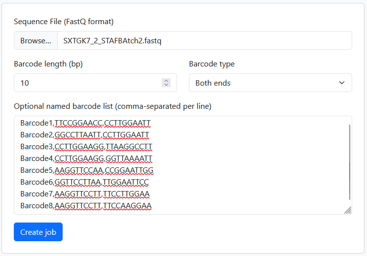
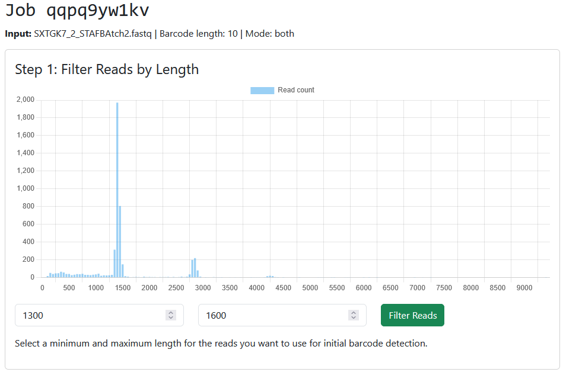
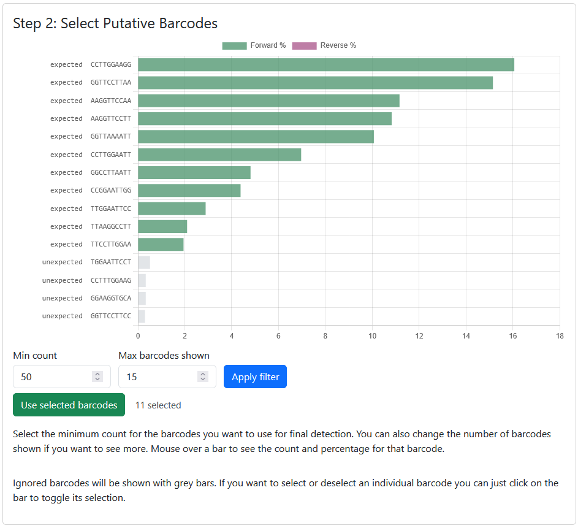
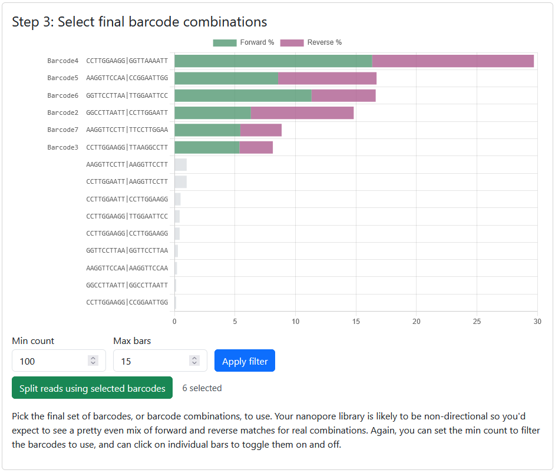
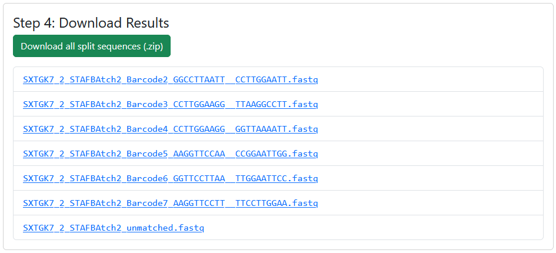

NanoSplit is a web application for splitting mixed nanopore FastQ reads by barcode. It guides you through uploading sequences, read-length filtering, barcode discovery, final barcode or barcode-pair quantitation, and download of split FastQ files.

You can run nanosplit from our server at .  There are instructions further down the page if you want to run the system on your own server.

# Using the program

Nanosplit runs you through a guided workflow:

## Data Loading and Job Setup



On the front screen you need to upload your FastQ file and tell the program about your barcodes.  This system is designed for small-scale nanopore experiments (thousands of sequences), such as those used to sequence PCR products or plasmids, not to split large sequencing runs (millions of sequences).

Your fastq file can be gzipped or uncompressed.

You need to tell us the length of your barcodes in bp.  It assumes all barcodes are the same length.  You can also say whether you have barcodes at just one end of your sequences, or at both ends.

Finally, you can tell the program which barcodes, or barcode combinations, you expect to see, and you can tell it the name you want to associate with these sequences.  This is optional.


## Read Length Filtering



Your sequencing run may contain some off-target sequences of a different size to the one you're expecting.  Nanopore sequencers also tend to produce multimeric sequences which have 2 or more reads concatenated.  To remove these artefacts the program will show you a graph of the distribution of observed read lengths in your file and allow you to set a filter on the minimum and maximum length of sequence to carry forward.

You can zoom in and out of the graph by putting your cursor into the graph and scrolling.

## Initial Barcode Selection


The program will initially look only at the start of your reads to try to discover barcodes.  It uses the 
front as the end of reads tends to be more unstable in nanpore sequencing and have spurious bases added, so this gives a cleaner result.

You will see the graph of observed barcodes along with their frequency in the full dataset.  At the bottom you can set a filter for the minimum count for barocdes you want to carry through to the next step.  You can also click on the bar for individual barcodes to add or remove it from the selected set.


## Final Barcode(s) Selection


The program will now do a more sensitive search for barcodes using the barcodes you selected in the previous step.  If you said that the library had barcodes at both ends it will search for combinations of barcodes.  If you told the program about the barcodes you were expecting then it will match the barcodes it finds to the expected set and will label the barcode(s) with the sample names you provided.

Again you can filter the barcodes shown to just the subset you finally want to use to split your file.

## Final Splitting


Finally you can use the selected barcode combinations to split your fastq file.  You can download the split files individually, or you can download a zip file containing all of the split subsets (including a file with the unmatched sequences in it).

# Local Installation

If you want to run your own copy of the program you use use the instructions below to install it on your own server.  You are free to modify the code under the terms of the GPL open source license.

Install Python 3.10 or newer, then create a virtual environment:

```bash
python3 -m venv venv
source venv/bin/activate
pip install -r requirements.txt
```

Run the development server:

```bash
python app.py
```

Open `http://127.0.0.1:5000/`.

# Production Installation

If you want to install the program to provide a service to others on your server then the instructions below will make a more robust and scalable installation of the software.

These commands assume the application will live at `/opt/nanosplit`, run as user `www-data`, and listen locally on port `8050`.

```bash
sudo apt update
sudo apt install python3 python3-venv apache2
sudo mkdir -p /opt/nanosplit
sudo chown www-data:www-data /opt/nanosplit
```

Copy the NanoSplit repository into `/opt/nanosplit`, then install dependencies:

```bash
cd /opt/nanosplit
sudo -u www-data python3 -m venv venv
sudo -u www-data ./venv/bin/pip install -r requirements.txt
sudo -u www-data ./venv/bin/pip install gunicorn
sudo -u www-data mkdir -p data
```

## Run With systemd

Create `/etc/systemd/system/nanosplit.service`:

```ini
[Unit]
Description=NanoSplit web application
After=network.target

[Service]
User=www-data
Group=www-data
WorkingDirectory=/opt/nanosplit
Environment=PYTHONUNBUFFERED=1
ExecStart=/opt/nanosplit/venv/bin/gunicorn --workers 2 --bind 127.0.0.1:8050 app:app
Restart=always

[Install]
WantedBy=multi-user.target
```

Start the service:

```bash
sudo systemctl daemon-reload
sudo systemctl enable --now nanosplit
sudo systemctl status nanosplit
```

The site should now be listening only on the server itself at `http://127.0.0.1:8050/`.

## Apache Reverse Proxy at `/nanosplit/`

Enable Apache proxy modules:

```bash
sudo a2enmod proxy proxy_http headers
sudo systemctl reload apache2
```

Add this to the relevant Apache virtual host, for example `/etc/apache2/sites-available/example.com.conf`:

```apache
<VirtualHost *:443>
    ServerName example.com

    # Existing TLS configuration goes here.

    ProxyPreserveHost On
    RequestHeader set X-Forwarded-Prefix "/nanosplit"
    RequestHeader set X-Forwarded-Proto "https"

    ProxyPass        /nanosplit/ http://127.0.0.1:8050/
    ProxyPassReverse /nanosplit/ http://127.0.0.1:8050/
</VirtualHost>
```

Reload Apache:

```bash
sudo apachectl configtest
sudo systemctl reload apache2
```

NanoSplit should then be available at:

```text
https://example.com/nanosplit/
```

To use a different local port, change both the `--bind 127.0.0.1:8050` value in the systemd service and the Apache `ProxyPass` / `ProxyPassReverse` target.

## Operational Notes

- Uploaded and generated files are kept in `/opt/nanosplit/data`.
- Ensure that the service user can write to `data/`.
- Apache handles public HTTPS traffic; Gunicorn should remain bound to `127.0.0.1`.
- For large FASTQ files, configure Apache upload limits and server disk capacity appropriately.
- The development server in `python app.py` is not intended for production hosting.
